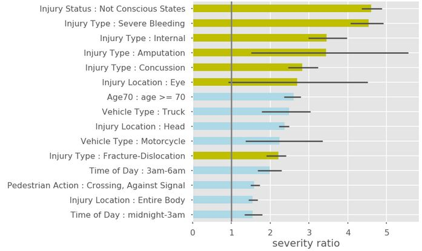

Folders:
* 1-Scope - includes project scope of work and background documents
* 2-Data - includes data dictionaries, exploritory data notebooks, and data cleaning scripts
* 3-Analysis - includes analysis notebooks and scripts
* img - images, graphs used in presentations and notebooks
* presentations - contains final presentations and other writeups

# Predicting Injury Outcomes using Data Linkage
Predicting which traffic crashes result in severe injuries helps to prioritize locations for street safety redesign.

# Overview
Using linked crash and hospital data we were able to evaluate DOT’s formula for assigning severity to pedestrian crashes. 

Our findings confirm that the current formula, which relies on police officer’s reporting of injury, largely tracks with hospital designated injury outcomes. However some improvement is possible. We developed two methods that improve upon the current formula.

In addition we found that the older adults are more vulnerable on city streets Pedestrians over age 70 were 2.5 times more likely to sustain severe injuries than a random pedestrian who is hit by a motor vehicle. 

This project was a partnership between MODA, DOT, and DOHMH. 

# 1. Scoping
Every year in NYC there are over 40 thousand traffic crashes where someone is injured. The vast majority of these injuries are minor. Around 250 crashes are fatal, but many more result in serious injuries, close to death, with potentially long term effects on the injured and their loved ones. Being able to separate out the most severe crashes from the rest allows for the City to have a more focused response on safety interventions, including where to prioritize street safety redesign.

NYC Department of Transportation (DOT) identifies areas with high concentrations of killed or severely injured (KSI) pedestrians as priority geographies for street safety redesign. For instance, “priority corridors” are defined as corridors with the highest KSI per mile over a 5 year time period, where at least 50% of KSI are covered in those areas. Whether or not a new street redesign project is in a priority area is one of the criteria that goes into determining when it gets completed.

Crashes resulting in deaths are relatively straightforward to identify but whether someone has sustained serious injuries is not well defined. Currently DOT uses a formula called KABCO created by NY State Department of Motor Vehicle (DMV). It categorizes people involved in crashes into five categories: K (killed), A (severe injury), B (moderate injury), C (minor injury), and O (no injury). Hence the KABCO name. These KABCO scores are based on three questions from the police crash report on the injured person(s): injury type, injury location, and injury status.

**DOT’s current KSI** metric refers to crashes with a K or A score from KABCO. These are crashes where:
* the reported **injury status** is one of the following: 
  - Death, Unconscious, Semiconscious, Incoherent; 
* the reported **injury type** is one of the following: 
  - Amputation, Concussion, Internal, Severe Bleeding, Severe/Moderate Burn, Fracture-Dislocation; 
* Or the **injury location** is 
  - the eye. 

While this formula has been used for some time, there hasn’t been a way to evaluate it or improve on it.

**Analytics Question:** How to predict which crashes are severe in order to inform prioritization of street redesign projects?

# 2. Data 

* MV104 crash database (crash, vehicle, and person tables)
* SPARCS hospital data

In 2017 DOHMH linked police crash report data with hospital data. Reference: Conderino, S, Fung, L  et al. “Linkage of traffic crash and hospitalization records with limited identifiers for enhanced public health surveillance” AA&P 2017.   

We used this linked data for our analysis. More details on the data can be found in [DataDetails.ipynb](https://github.com/MODA-NYC/Project_SevereCrashes/blob/master/2-Data/DataDetail.ipynb) notebook.

# 3. Analysis

We developed the Severity Ratio to show which crash attributes are more indicative of severe crashes. SR is defined as the probability of an injured person in a crash having severe injuries given a specific crash attribute is present divided by the overall probability of an injured person having severe injuries. For pedestrians and bicyclists around 10% of the injured are severe. 

More details can be found in the [SeverityRatio.ipynb](https://github.com/MODA-NYC/Project_SevereCrashes/blob/master/3-Analysis/SeverityRatio.ipynb) notebook.

In addition, we propose two methods for developing a new KSI formula. The formulas are evaluated using precision and recall metrics, where the ground truth is the hospital outcomes (b-ISS severity). 

**New KSI formula 1: KABCO Plus**
This is the most straightforward approach to changing the KABCO formula. In addition to crashes that are ranked K or A in KABCO, we also include other crash attributes that had high SR. These include: head injuries, age 70+, and the other vehicle being a motorcycle or truck. We found that adding in any or all of these categories captures more severe cases, but decreases the percentage of actual severe cases in the labeled or target group. 

**New KSI formula 2: Scoring system using logistic regression models**
We used logistic regression to develop a more flexible method allowing us to keep precision constant while improving recall by around 20%.

The simpler formula (KABCO Plus) presents us with a trade off of precision and recall compared to the current formula. A more complicated model can improve on either precision or recall, but the improvement is modest.. 

More details on these formulas can be found in the [NewFormulas.ipynb](https://github.com/MODA-NYC/Project_SevereCrashes/blob/master/3-Analysis/NewFormulas.ipynb) notbook.

# 4. Pilot
DOT decided, based on this analysis, the current KABCO system for identifying severe crashes is sound and they will not change it going forward. 

Independent of this analysis, DOT has started researching safety engineering standards focused on older adults. 

# 5. Handoff
Not Applicable.
